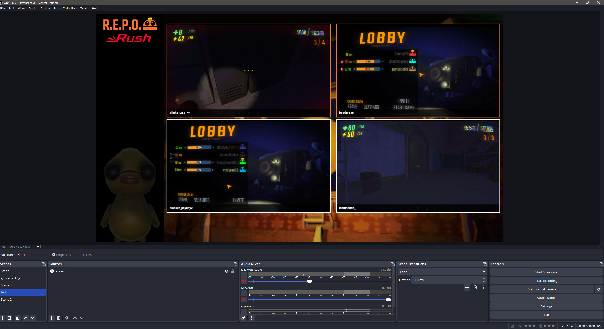
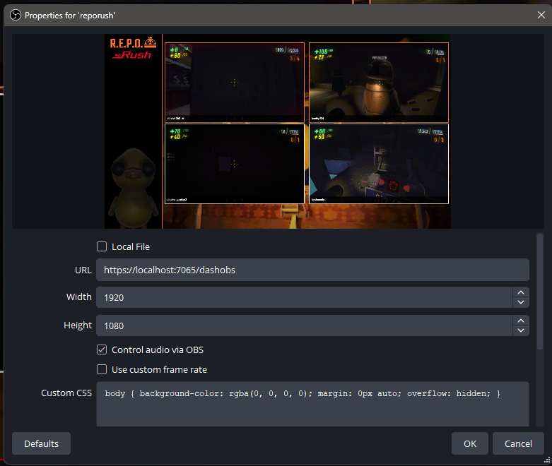
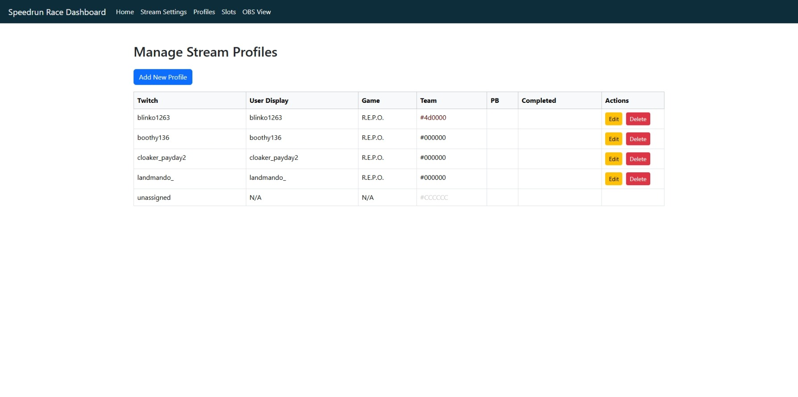
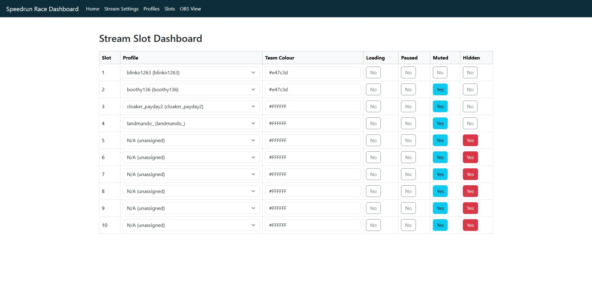

# Speedrun Race Dashboard

A quick solution to displaying and managing Twitch streams for speedrun races and marathons.

## About

This tool was originally created for Halo speedrunning marathons but was later replaced by a more complex system. This release is intentionally minimal—focused purely on the core feature of getting Twitch streams into a clean, customizable layout.

It has been rewritten and may contain bugs, so let me know!

## Usage

Simply set up a **Browser Source** in OBS pointing to the localhost address shown on the homepage after launch.  
Designed for a resolution of **1920x1080**.

You can also append query parameters to the URL for additional options:

- `showspecific=ID` – Displays only a specific profile ID in a large, dedicated section. Useful for creating individual OBS scenes per slot.
- `nosidebar=true` – Hides the sidebar so streams use the full width of the screen.

## Installation

1. [Download the latest release](https://github.com/danielmccluskey/SpeedrunRaceDashboard/releases)
2. Run `SpeedrunRaceDashboard.exe` to start the local server  
   > This application must remain running for the dashboard to function.

A file named `race.db` will be created in the same folder, this serves as your configuration database. You can back it up or swap it out to maintain settings across different events.

## Preview

### Profile Configuration  

### Slot Layout  

